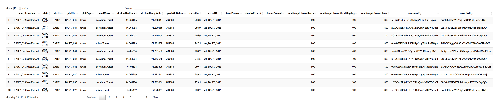
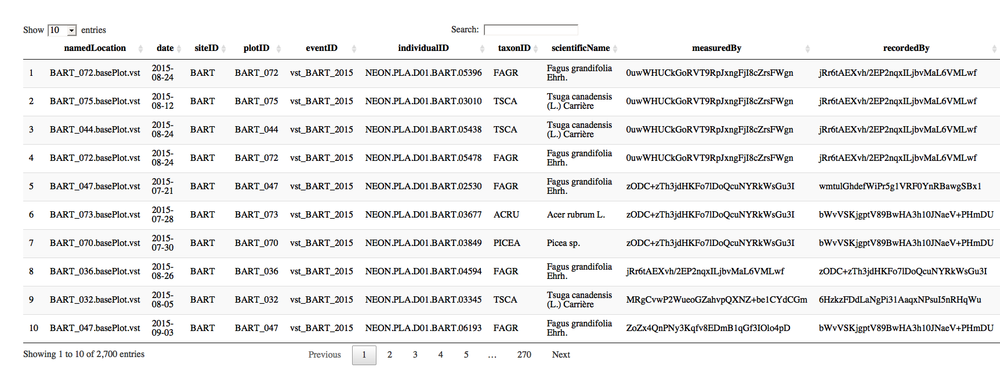

<!-- README.md is generated from README.Rmd. Please edit that file -->
dataspice-tutorial
==================

The goal of dataspice-tutorial is to ...

Data source : NEON data portal
------------------------------

### *Woody plant vegetation structure*

> This data product contains the quality-controlled, native sampling resolution data from in-situ measurements of live and standing dead woody individuals and shrub groups, from all terrestrial NEON sites with qualifying woody vegetation. The exact measurements collected per individual depend on growth form, and these measurements are focused on enabling biomass and productivity estimation, estimation of shrub volume and biomass, and calibration / validation of multiple NEON airborne remote-sensing data products. In general, comparatively large individuals that are visible to remote-sensing instruments are mapped, tagged and measured, and other smaller individuals are tagged and measured but not mapped. Smaller individuals may be subsampled according to a nested subplot approach in order to standardize the per plot sampling effort. Structure and mapping data are reported per individual per plot; sampling metadata, such as per growth form sampling area, are reported per plot. For additional details, see protocol NEON.DOC.000987vG: TOS Protocol and Procedure: Measurement of Vegetation Structure, and Science Design NEON.DOC.000914: TOS Science Design for Plant Biomass, Productivity and Leaf Area Index.

------------------------------------------------------------------------

### `dataspice` exercise data

The data are a trimmed subset of data downladed from th NEON [data portal](http://data.neonscience.org/browse-data) after filtering for:

-   time periods between **`2015-06` - `2016-06`**

-   locations within NEON Domain area **`D01: Northeast`**

Filter returned data from **2 sites** from **`2015-6`** to **`2015-11`**.

### vst\_perplotperyear.csv

Plot level data

### vst\_mappingandtagging.csv

Individual level data

