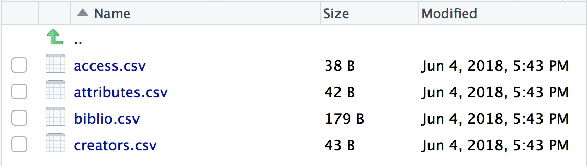
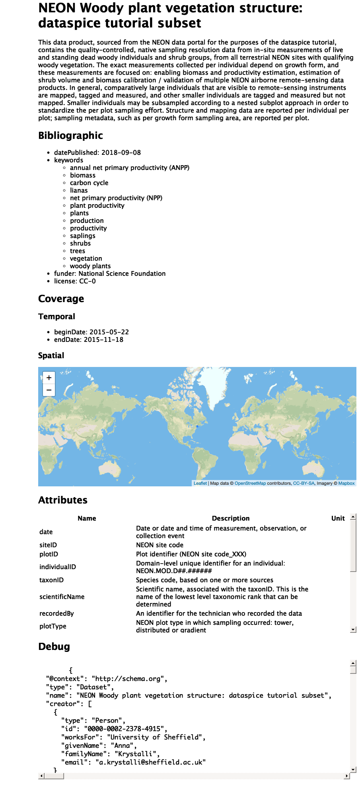

<br>

The goal of dataspice-tutorial is to provide a **practical exercise in creating metadata** for an **example field collected data product** using package `dataspice`. 

- Understand basic metadata and why it is important.

- Understand where and how to store them.

- Understand how they can feed into more complex metadata objects.


## `dataspice` workflow


_see [introductory slides](http://annakrystalli.me/dataspice-tutorial/slides.html) for further background_

<br>

***

# Setup

## create workshop project

Let's [**create a new Rstudio project**](https://www.tidyverse.org/articles/2017/12/workflow-vs-script/) in which to work:

### File > New Project > New Directory > New Project > "Practical Data Management"

In our new project, let's **create a `data/` folder** in which to store the data.

```{r, eval=FALSE, warning=FALSE, message=FALSE}
dir.create("data")
```

Let's also open a new R script in which to work:

### File > New File > R Script 

Save it in the **project root**, eg as `metadata_dev.R`


---

## Packages

Let's **install and load all the packages** we'll need for the workshop:

```{r, eval=FALSE}
install.packages("tidyverse")
install.packages("here")
install.packages("devtools")
devtools::install_github("ropenscilabs/dataspice")
```


```{r, message=FALSE}
library(tidyverse)
library(dataspice)
```

<br>

***

# Data

**For more information on the data source check the tutorial [README](https://github.com/annakrystalli/dataspice-tutorial)**

## Get data

The `readr::read_csv()` function allows us to **download and read in raw csv data** from a URL.

- URL for `vst_mappingandtagging.csv` at <https://raw.githubusercontent.com/annakrystalli/dataspice-tutorial/master/data/vst_mappingandtagging.csv>

- URL for `vst_perplotperyear.csv` at <https://raw.githubusercontent.com/annakrystalli/dataspice-tutorial/master/data/vst_mappingandtagging.csv>

```{r, message=FALSE}
vst_mappingandtagging <- read_csv("https://raw.githubusercontent.com/annakrystalli/dataspice-tutorial/master/data/vst_mappingandtagging.csv")

vst_perplotperyear <- read_csv("https://raw.githubusercontent.com/annakrystalli/dataspice-tutorial/master/data/vst_perplotperyear.csv")
```

### Inspect data

You can **inspect any object** in your environment in Rstudio using function `View()`

##### `vst_mappingandtagging`

```{r, eval = F}
vst_mappingandtagging %>% View()
```


```{r, echo=FALSE}
DT::datatable(vst_mappingandtagging)
```

##### `vst_perplotperyear`

```{r, eval=FALSE}
vst_perplotperyear %>% View()
```

```{r, echo=FALSE}
DT::datatable(vst_perplotperyear)
```

## Save data

```{r, eval=FALSE}
write_csv(vst_mappingandtagging, here::here("data", "vst_mappingandtagging.csv"))

write_csv(vst_perplotperyear, here::here("data", "vst_perplotperyear.csv"))
```

Once we've saved our data files in the data folder, we can **use functions in the `dataspice` package to create metadata files and complete them**.

<br>

***

# Create metadata files

We'll **start by creating the basic metadata `.csv` files** in which to collect metadata related to our example dataset using function **`dataspice::create_spice()`**.

```{r, eval=FALSE}
create_spice()
```

This **creates a `metadata` folder** in your project's `data` folder (although you can specify a different directory if required) containing **4 `.csv` files** in which to record your metadata.




<br>


- **access.csv**: record details about where your data can be accessed.
- **attributes.csv**: record details about the variables in your data.
- **biblio.csv**: record dataset level metadata like title, description, licence and spatial and temoral coverage.
- **creators.csv**: record creator details.

<br>

---

# Record metadata

<br>

## `creators.csv`

#### The `creators.csv` contains details of the **dataset creators**.

Let's start with a quick and easy file to complete, the **creators**. We can **open and edit** the file using in an **interactive shiny app** using **`dataspice::edit_creators()`**. 

***Although we did not collect this data, just complete with your own details for the purposes of this tutorial.***


```{r, eval=FALSE}
edit_creators()
```


Remember to click on **Save** when you're done editing.

<br>

## `access.csv`

#### The `access.csv` contains details about **where the data can be accessed**.

Before manually completing any details in the `access.csv`,  we can use `dataspice`'s  dedicated function **`prep_access()` to extract relevant information** from the data files themselves.

```{r, eval=FALSE}
prep_access()
```

Next, we can **use function `edit_access()`** to complete the final details required, namely **the URL at which each dataset can be downloaded from**. Use the URL from which we donloaded each data file in the first place (hint `r emo::ji("point_up")`).

We can also edit details such as the `name` field to something more informative if required.


```{r, eval=FALSE}
edit_access()
```


Remember to click on **Save** when you're done editing.

<br>

## `biblio.csv`

#### The `biblio.csv` contains dataset level metadata like **title**, **description**, **licence** and **spatial** and **temoral coverage**.

Before we start filling this table in, we can use some base R functions to extract some of the information we require. In particular we can **use function `range()` to extract the temporal and spatial extents of our data from the columns containing temporal and spatial data.**


#### get **temporal extent**

Although dates are stored as a text string, **because they are in ISO format (YYYY-MM-DD), sorting them results in correct chronological ordering**. If your temporal data is not in ISO format, consider converting them (see package `lubridate`)

```{r}
range(vst_perplotperyear$date, vst_mappingandtagging$date) 
```

#### get **geographical extent**

The lat/lon coordinates are in decimal degrees which again are easy to sort or calculate the range in each dimension. 

##### South/North boundaries

```{r}
range(vst_perplotperyear$decimalLatitude)
```

##### West/East boundaries

```{r}
range(vst_perplotperyear$decimalLongitude)
```

_NB: you can also supply the geographic boundaries of your data as a single [well-known text string](https://en.wikipedia.org/wiki/Well-known_text) in field `wktString` instead of supplying the four boundary coordinates._

<br>

Now that we've got the values for our temporal and spatial extents, we can **complete the fields in the `biblio.csv` file using function `dataspice::edit_biblio()`**. 

```{r, eval=FALSE}

edit_biblio()
```


Remember to click on **Save** when you're done editing.


<div class="alert alert-success">
#### `r emo::ji("mag")` metadata hunt

Additional information required to complete these fields can be found on the [**NEON data portal page for this dataset**](http://data.neonscience.org/data-product-view?dpCode=DP1.10098.001) and the **`dataspice-tutorial` repository [README](https://github.com/annakrystalli/dataspice-tutorial)**.
</div>

<br>

## `attributes.csv`

#### The `attributes.csv` contains details about the **variables** in your data.

Again, `dataspice` provides functionality to **populate the `attributes.csv` by extracting the variable names from individual data files** using function **`dataspice::prep_attributes()`**.

We can map the function over each `.csv` file in our `data/` folder by using function `purrr::map()`.

```{r}
data_files <- list.files(here::here("data"),
                         pattern = ".csv",
                        full.names = TRUE)

data_files
```

```{r, eval=FALSE}
data_files %>% purrr::map(~prep_attributes(.x))
```


<br>

We can now use `dataspice::edit_attributes()` to fill in the final details, namely the **description** and **units** associated with the variables.

```{r, eval=FALSE}
edit_attributes()
```


Remember to click on **Save** when you're done editing.

<div class="alert alert-success">
#### `r emo::ji("mag")` metadata hunt

For dataspice, we have opted to use **unit specification which can be parsed by R pkg [`units`](https://r-quantities.github.io/units/index.html)**, a package which provides a class for maintaining unit metadata and functionality for checking compatibility and conversion. `units` is **itself based on the [**`UDUNITS-2`**](https://www.unidata.ucar.edu/software/udunits/udunits-current/doc/udunits/udunits2.html#Introduction) C library**, a library for **units of physical quantities** and **unit-definition** and **value-conversion** utility. 

You can install and search for units using `units` pkg (have a look at the package [vignette](https://r-quantities.github.io/units/articles/measurement_units_in_R.html)), but for a quicker browsing and searching of units, you can use the handy ["Units and Symbols Found in the UDUNITS2 Database" web app](https://ncics.org/portfolio/other-resources/udunits2/?) by the **North Carolina Institute for Climate Studies** to identify **prefixes** and **base unit** definitions. 

For now, use the **name** rather than the **symbol** UDUNITS definition. More **complex units can be definied arithmetically and by combining base units**. (eg meter cubed could be specificied  as `m3` or `m^3`. See `units` [vignette](https://r-quantities.github.io/units/articles/measurement_units_in_R.html#handling-data-with-units-in-r-the-units-package) for more details).

<br>

Additional information required to complete these fields can be found on the [**NEON data portal page for this dataset**](http://data.neonscience.org/data-product-view?dpCode=DP1.10098.001) and the **`dataspice-tutorial` repository [README](https://github.com/annakrystalli/dataspice-tutorial)**.

</div>

<br>

***

# Create metadata json-ld file

Now that all our metadata files are complete, we can **compile it all into a structured `dataspice.json` file** in our `data/metadata/` folder. 

```{r}
write_spice()
```

Here's an interactive view of the `dataspice.json` file we just created:

```{r}
jsonlite::read_json(here::here("data", "metadata", "dataspice.json")) %>% listviewer::jsonedit()
```

**Publishing this file on the web means it will be indexed by Google Datasets search!** `r emo::ji("smiley")` `r emo::ji("+1")` 

<br>

***

# Build README site

Finally, we can **use the `dataspice.json` file** we just created to **produce an informative README web page** to include with our dataset for humans to enjoy! `r emo::ji("star_struck")`

We use function **`dataspice::build_site()`** which **creates file `index.html`** in the `docs/` folder of your project (which it creates if it doesn't already exist).


```{r}
build_site()
```

<br> 

#### View the resulting file [here](http://annakrystalli.me/dataspice-tutorial/docs/index.html)

<br>

Here's a screen shot!



***

#### _back to the [outro slides](http://annakrystalli.me/dataspice-tutorial/slides.html#32)_