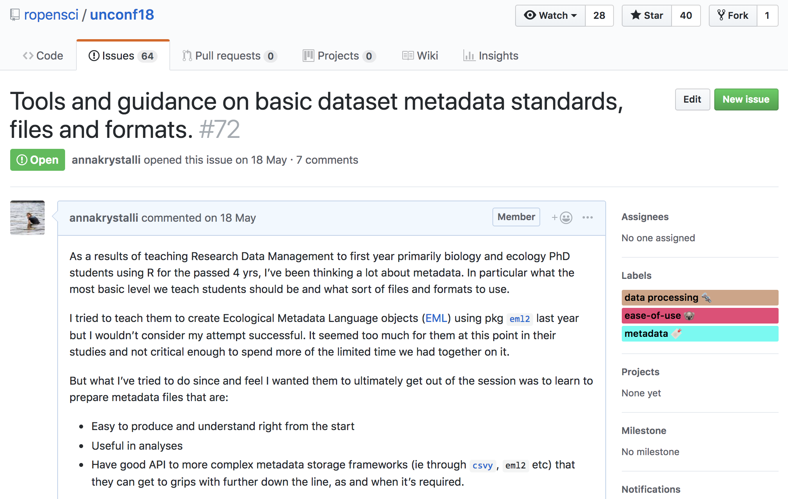
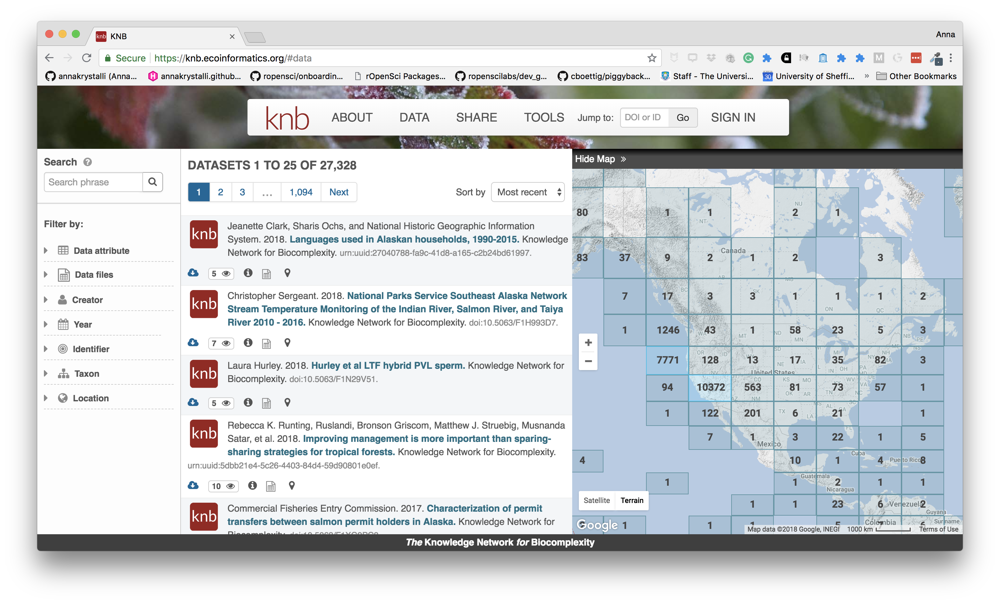
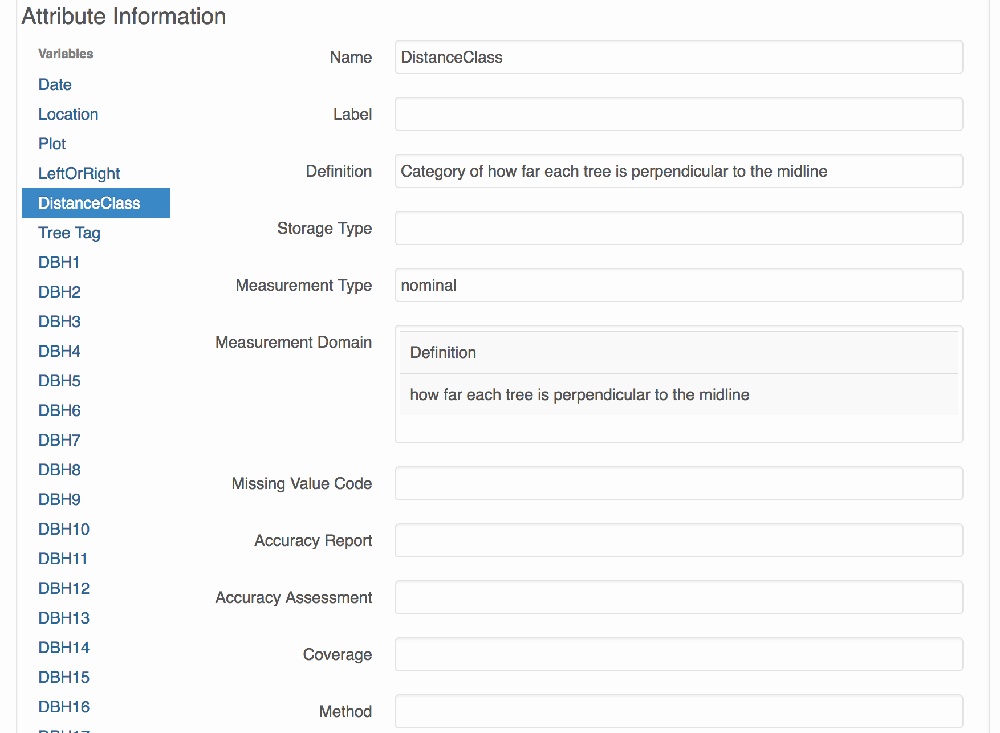

# `r emo::ji("wave")` Hello and welcome

### me: Dr Anna Krystalli

- **Research Software Engineer**, _University of Sheffield_
    + twitter **@annakrystalli**
    + github **@annakrystalli**
    + email **a.krystalli[at]sheffield.ac.uk**

--

- **Backround**
    + PhD in Marine Macroecology (data parasite `r emo::ji("imp")`)
--
    + [rOpenSci](http://onboarding.ropensci.org/) Editor
--
    + ACCE Doctoral Partnership **Research Data Management** course instructor

---
class: inverse, middle, center

# Background

---

# [ACCE DTP RDM](https://acce.shef.ac.uk/event/acce-data-management-workshop/) course
##### May 1 - 2, 2018

<br>

Includes a **section on Metadata** `r emo::ji("sparkles")`

--
- **Defining** Metadata & **explaining importance**: `r emo::ji("white_check_mark")`

--

- Advising on domain specific **Controlled Vocabularies** & **structure** `r emo::ji("x")`


---

# [rOpenSci Unconf 18](http://unconf18.ropensci.org/)
##### May 21 - 22, 2018. Seattle


---

---    

# rOpenSci Unconf mission


> bringing together scientists, developers, and open data enthusiasts from academia, industry, government, and non-profits to get together for a few days and hack on various projects.

<br>

#### Ideas for projects submitted through GitHub [**issues**](https://github.com/ropensci/unconf18/issues) in the [**runconf18** repo](https://github.com/ropensci/unconf18)

---

## issue [#72](https://github.com/ropensci/unconf18/issues/72) `r emo::ji("raising_hand_woman")`




---


# Metadata team!
------------

Luckily, a **whole bunch of other awesome folks** were also thinking about these topics and interested in working on them! `r emo::ji("star_struck")`

(in alphabetical order):

-   [Carl Boettiger](https://github.com/cboettig)
-   [Scott Chamberlain](https://github.com/sckott)
-   [Auriel Fournier](https://github.com/aurielfournier): #[41](https://github.com/ropensci/unconf18/issues/41)
-   [Kelly Hondula](https://github.com/khondula)
-   [Anna Krystalli](https://github.com/annakrystalli)
-   [Bryce Mecum](https://github.com/amoeba)
-   [Maëlle Salmon](https://github.com/maelle)
-   [Kate Webbink](https://github.com/magpiedin): #[52](https://github.com/ropensci/unconf18/issues/52)
-   [Kara Woo](https://github.com/karawoo): #[68](https://github.com/ropensci/unconf18/issues/68)


---


# [rOpenSciLabs](https://github.com/ropenscilabs) pkg [**`dataspice`**](https://github.com/ropenscilabs/dataspice) 

> Package [**`dataspice`**](https://github.com/ropenscilabs/dataspice) makes it easier for researchers to **create basic, lightweight and concise metadata files for their datasets**. 

<br>

- Metadata **collected in `csv` files**

--

- Metadata fields are **based on [schema.org](http://schema.org/Dataset)**
    + underlies Google [Datasets](https://developers.google.com/search/docs/data-types/dataset) metadata specification

--

- Helper functions and shinyapps to **extract and edit metadata files**.

--

- Ability to produce:
    + **structured json-ld metadata file**.
    + a helpful dataset **README webpage**.
 
    
<br> 

---

### [Google unveils search engine for open data](https://www.nature.com/articles/d41586-018-06201-x)
#### _The tool, called Google Dataset Search, should help researchers to find the data they need more easily._
##### Nature NEWS - 05 SEPTEMBER 2018


<br>

***

<https://toolbox.google.com/datasetsearch>

---
class: inverse, middle, center

# `dataspice` tutorial

<br>

#### tutorial repo: 
### <https://github.com/annakrystalli/dataspice-tutorial>

#### useful links: 
### <http://annakrystalli.me/dataspice-tutorial/useful_links.html>

---

# `dataspice` tutorial

<br>

The goal of dataspice-tutorial is a **practical exercise in creating metadata** for an **example field collected data product** using package `dataspice`. 

- Understand basic metadata and why it is important

--

- Understand where and how to store them

--

- Understand how they can feed into more complex metadata objects.

---


## `dataspice` workflow


---


# Example dataset

### Data source : 

#### [National Ecological Observatory Network](https://www.neonscience.org/) (NEON) data portal 


### Dataset selected:

#### *Woody plant vegetation structure*

 This data product contains the quality-controlled, native sampling resolution data from **in-situ measurements of live and standing dead woody individuals and shrub groups**, from all **terrestrial NEON sites** with qualifying woody vegetation. 

--
 
- **Structure and mapping data** are reported **per individual per plot**

- **Sampling metadata**, such as per growth form sampling area, are reported **per plot**. 

---

# `dataspice` workshop data


The data are a **trimmed subset** of data downladed from the [**NEON data portal**](http://data.neonscience.org/browse-data) after filtering for:

- time periods between **`2015-06` - `2016-06`**

- locations within NEON Domain area **`D01: Northeast`**

Filter returned data from **2 sites** from **`2015-6`** to **`2015-11`**.

<br>

***

##### Citation:
_National Ecological Observatory Network. 2018. Data Products: DP1.10098.001.  Provisional data downloaded from http://data.neonscience.org on 2018-05-04. Battelle, Boulder, CO, USA_

```{r, echo=FALSE, message=FALSE, warning=FALSE}
library(dplyr)
```

---

## vst_perplotperyear.csv

Plot level data

```{r, echo=FALSE, message=FALSE}
library(kableExtra)
readr::read_csv(here::here("data", "vst_perplotperyear.csv")) %>% head(20) %>% knitr::kable(format = 'html') %>%
  kable_styling() %>%
  scroll_box(width = "100%", height = "300px")
```

---

## vst_mappingandtagging.csv

Individual level data

```{r, echo=FALSE, message=FALSE}
readr::read_csv(here::here("data", "vst_mappingandtagging.csv")) %>% head(20) %>% knitr::kable(format = 'html') %>%
  kable_styling() %>%
  scroll_box(width = "100%", height = "300px")
```


---
class: inverse, middle, center

# Practical

--

### time for some live coding `r emo::ji("scream")`

<br>
<br>

***

_or head to the [tutorial](http://annakrystalli.me/dataspice-tutorial/) if working through this on your own_

---
class: inverse, middle, center

# Outro


---

# Additional metadata tips

- ### The approach we went for is very general / minimal

--

- #### You can **make your datasets more discoverable** by developing **richer/more domain specific metadata** files. 
--

- eg. create [Ecological Metadata Language (EML)](https://knb.ecoinformatics.org/#external//emlparser/docs/index.html) metadata using r pkg [`eml2`](https://github.com/cboettig/eml2). 

--  

- reposit your data at [KNB](https://knb.ecoinformatics.org/#data)

--

- allows richer [search and presentation of metadata](https://knb.ecoinformatics.org/#view/IC.13.1)
    
---
# KNB data portal

## Powerful search




---

# KNB data portal

## Rich interactive metadata




---

# Parting words

--

- #### Any metadata documentation is better than none `r emo::ji("+1")`

--

- Got ideas for features / found any bugs? Open an [issue](https://github.com/ropenscilabs/dataspice/issues)! 

--

- Are you into metadata? [Become a contributor](https://github.com/ropenscilabs/dataspice/)!

--

- If you use the [`xaringan`](https://slides.yihui.name/xaringan/#1) pkg, don't forget to try the `yolo=true` option, of `xaringan::moon_reader`.

--

## `r emo::ji("wave")`